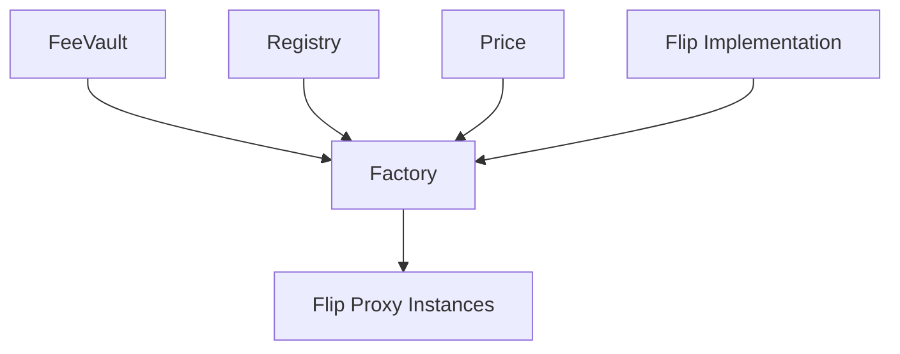

# FLIP system contract deployment guide

This document describes how to deploy the FLIP system contracts.

## Contract dependencies



## Deployment scripts

### 1. Full deployment (`deployFactoryComplete.ts`)

**Purpose**: Deploy all FLIP system contracts from scratch

**Deployment order**:
1. FeeVault contract
2. Registry contract  
3. Price contract
4. Flip Implementation contract
5. Factory contract

**Usage**:
```bash
npx hardhat run scripts/deployFactoryComplete.ts --network <network-name>
```

**Output**: All contract addresses and verification commands

### 2. Only deploy Factory (`deployFactoryOnly.ts`)

**Purpose**: Deploy only the Factory contract when other dependent contracts are already deployed

**Prerequisites**: Need to deploy the following contracts and get the addresses:
- Registry
- FeeVault  
- Price
- Flip Implementation

**Usage**:
1. Edit the `deployFactoryOnly.ts` file
2. Replace the following address constants:
   ```typescript
   const REGISTRY_ADDRESS = "0x您的Registry地址";
   const FEE_VAULT_ADDRESS = "0x您的FeeVault地址";  
   const PRICE_CONTRACT_ADDRESS = "0x您的Price地址";
   const FLIP_IMPLEMENTATION_ADDRESS = "0x您的FlipImplementation地址";
   ```
3. Run the deployment script:
   ```bash
   npx hardhat run scripts/deployFactoryOnly.ts --network <network-name>
   ```

## Key concepts

### Flip Implementation 

- **Singleton pattern**: The system only needs one Flip Implementation instance
- **Shared logic**: All FLIP NFTs created through the Factory use the same logic contract
- **Proxy pattern**: Each FLIP NFT is an ERC1967Proxy, delegating to the shared Implementation

### Factory contract

The constructor of the Factory contract needs 4 parameters:
```solidity
constructor(
    address _registry,        // Registry contract address
    address _feeVault,       // FeeVault 合约地址  
    address _priceContract,  // Price 合约地址
    address _flipImplementation // Flip Implementation 地址
)
```

## Verification commands

After deployment, the script will automatically output Etherscan verification commands. For example:

```bash
# Verify Factory contract
npx hardhat verify --network mainnet 0xFactoryAddress "0xRegistryAddress" "0xFeeVaultAddress" "0xPriceAddress" "0xFlipImplementationAddress"
```

## Network configuration

Ensure that the target network is configured in the `hardhat.config.ts` file:

```typescript
networks: {
  mainnet: {
    url: "https://mainnet.infura.io/v3/YOUR-PROJECT-ID",
    accounts: ["YOUR-PRIVATE-KEY"]
  },
  goerli: {
    url: "https://goerli.infura.io/v3/YOUR-PROJECT-ID", 
    accounts: ["YOUR-PRIVATE-KEY"]
  }
}
```

## Security reminders

1. **Private key security**: Use environment variables or `.env` files to store private keys
2. **Testnet first**: Verify the deployment process on a testnet first
3. **Address verification**: Carefully check all dependent contract addresses before deployment
4. **Gas fees**: Estimate the gas fees before deploying on the mainnet

## Troubleshooting

### Common errors

1. **Address format error**: Ensure that all addresses are valid Ethereum address formats
2. **Insufficient balance**: Ensure that the deployment account has enough ETH to pay for gas fees
3. **Network connection**: Ensure that the network RPC endpoint is accessible
4. **Contract verification failed**: Check if the constructor parameters are correct

### Test deployment

It is recommended to test on a local network or testnet first:

```bash
# Start local network
npx hardhat node

# Deploy to local network  
npx hardhat run scripts/deployFactoryComplete.ts --network localhost
``` 